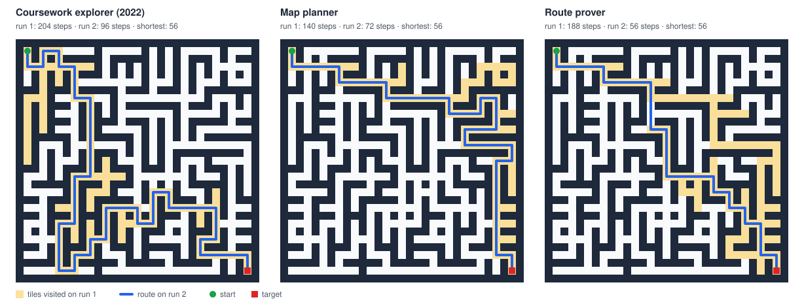

# Maze Robot Learning

[](https://github.com/AlexandruPascu/maze-robot-learning/actions/workflows/build.yml)

A robot explores a maze it has never seen, then runs it again using what it learned. This
repository runs my 2022 university coursework robot alongside two planning robots and an A\* oracle
on thousands of seeded mazes and measures what each one gains on its second run. One planner proves
which route is shortest before it finishes its first run, so every later run takes it. The simulator is
self-contained Java 21, deterministic on every platform, and ready for learned agents.



*One Prim maze of 15×15 cells, with 10% of the walls left after carving knocked through, seed 1. Regenerate it with
`./gradlew run --args="render"`.*

## Results

Mean steps over 300 seeded mazes of 15×15 cells for each layout. Run 1 explores the unseen maze; run
2 starts again from the same place with whatever the robot remembered. "Shortest" is the A\* route.

| Maze, 15×15 cells | Shortest | Coursework run 1 | Coursework run 2 | Map planner run 1 | Map planner run 2 | Route prover run 1 | Route prover run 2 |
| --- | ---: | ---: | ---: | ---: | ---: | ---: | ---: |
| Prim, no loops | 59.4 | 437.9 | 59.4 | 303.1 | 59.4 | 295.4 | 59.4 |
| Backtracker, no loops | 183.7 | 411.6 | 183.7 | 183.7 | 183.7 | 183.7 | 183.7 |
| Prim, 10% loops | 57.2 | 640.8 | 130.4 | 187.5 | 74.0 | 256.1 | 57.2 |
| Backtracker, 10% loops | 80.7 | 667.0 | 265.0 | 127.1 | 101.9 | 309.9 | 80.7 |
| Prim, 25% loops | 56.4 | 830.0 | 261.8 | 118.5 | 72.9 | 218.0 | 56.4 |
| Backtracker, 25% loops | 61.2 | 886.6 | 395.0 | 86.3 | 75.5 | 223.0 | 61.2 |

The [full results](reports/summary.md) also cover 7×7 and 30×30 mazes. They show:

- **Perfect mazes have one route, and all three robots replay it.** Run 2 was a shortest route in
  every maze, for every robot.
- **The 2022 claim of "an average of 4x steps decrease on the 2nd run" depends on the maze.** On
  perfect mazes the median gain is 3.7× at 7×7 Prim and 14.7× at 30×30. It is only 1.4–2.4× on
  perfect backtracker mazes, whose single route already threads through much of the maze.
- **Loops break replay.** The coursework robot repeats its exploration trail, detours included. Its
  run 2 averages 1.7–13.1× the shortest route on mazes with loops. The map planner plans a fresh
  route on its map and stays within 1.1–1.5×.
- **The route prover's second run was a shortest route in all 5,400 benchmark mazes.**
  - **Perfect mazes:** its first run is 2–6% shorter than the map planner's on Prim mazes and the
    same on backtracker mazes.
  - **Mazes with loops:** the proof costs extra exploration on run 1, for example 256.1 steps instead
    of 187.5 on 15×15 Prim mazes with 10% loops. The prover has walked fewer steps in total by the
    5th to 17th run of the same maze.
- **On perfect backtracker mazes the first run of both planners is already a shortest route.** This
  held in all 900 such benchmark mazes, and tests check it with random targets. It follows from how depth-first
  carving works: every wall separates a cell from one of its ancestors in the carving tree. Each side
  branch is therefore sealed by walls the robot saw on its way in, and an optimistic planner never
  enters one. Prim mazes have no such guarantee.
- **A\* finds routes as short as Dijkstra's algorithm while expanding 8–77% fewer tiles.** The
  heuristic helps least on backtracker mazes without loops, whose winding corridors point away from
  the target.
- **D\* Lite made exactly the same moves as searching again from scratch in every benchmark maze,
  with 4.0–77.4× less work.** It repairs only what each newly seen wall changes, so its advantage
  grows with the maze.

## Quick start

You need JDK 21 or newer. The Gradle wrapper downloads Gradle itself. On Windows, use `gradlew.bat`.

```sh
./gradlew build                                                      # compile and run the tests
./gradlew run --args="show --agent route-prover --loops 0.25 --seed 4" # one maze in the terminal
./gradlew run --args="benchmark"                                     # about 20 s; rewrites reports/
./gradlew run --args="render"                                        # rewrites docs/maze.svg
./gradlew run --args="help"                                          # every option
```

`show` draws the maze two characters per tile, so it looks square, under a legend. It compares the
run-2 route with the shortest route that overlaps it most:

| Mark | Meaning |
| --- | --- |
| `##` | Wall |
| `..` | Visited on run 1 only |
| `**` | Run 2 on a shortest route |
| `~~` | Run 2 detour |
| `++` | Shortest route that run 2 missed |
| `S`, `T` | Start and target |

Options select:

- the robot: `coursework`, `map-planner`, `route-prover` or `a-star`;
- the layout: `prim` or `backtracker`;
- the size in cells, the share of loops, a corner or random target, and the seed.

The drawing is in colour when the output reaches a terminal. Through `./gradlew run`, which hides
the terminal from the program, it assumes one whenever `TERM` names a terminal type, so add
`--color never` when redirecting that command's output to a file. Colour only restyles the same
characters. `NO_COLOR=1` turns it off and `FORCE_COLOR=1` turns it on; `--color always` or
`--color never` beats both.

## The robots

**Coursework explorer (2022).** My original CS118 solution, run unchanged apart from an injectable
random source. On run 1 it explores at random, depth first. It prefers exits it has not visited,
backtracks from dead ends, and keeps a stack of the cells on its current route with the heading it
arrived in. On run 2 it replays that stack.

**Map planner.** Records every wall and passage it senses in a map that it keeps between runs.

- **Run 1:** it heads along a shortest route to the target as if every unknown tile were open, which
  robot navigation calls planning under the freespace assumption. It plans with D\* Lite (Koenig and
  Likhachev, 2002). D\* Lite searches backwards from the target and, when the robot sees a new wall,
  repairs only the distances that wall changes.
- **Run 2:** it plans only through tiles it has seen to be open, so it never gambles on an unexplored
  shortcut, and sometimes misses one.

**Route prover.** Explores until it can prove which route is shortest, in the spirit of Micromouse
robots that search a maze before racing it. It knows the maze is a grid of cells with fixed pillars
between them, so it reasons about the walls between cells.

- **Two bounds:** treating unknown walls as open gives a lower bound on the shortest route from the
  start. Using only passages it has seen gives an upper bound. When the two meet, the known route is
  provably shortest.
- **What to inspect:** until then it inspects the nearest unknown wall that lies on a route as short
  as the lower bound, preferring walls nearer the target.
- **The target:** it does not step onto the target until the proof is complete, so run 2 and every
  run after it take a shortest route.

**A\* oracle.** Is handed the full map and follows an A\* route using the Manhattan distance, which
never overestimates on this grid. It sets the lower bound for the other robots. The benchmark also
runs Dijkstra's algorithm, which is A\* without the heuristic, to measure how much work the
heuristic saves.

## The simulator

- **Mazes:** a maze is a grid of wall and floor tiles with cells on odd coordinates. A perfect maze
  is carved by randomised Prim's algorithm or a recursive backtracker, starting from the top-left
  cell. Loops come from knocking through a share of the remaining walls between cells. The target is
  the bottom-right cell or a random one.
- **Sensing and moving:** sensing matches the coursework framework. Before each step a robot sees its
  four neighbouring tiles as wall, passage or been-before, plus its position, heading, the target's
  position and the run number. It then turns and moves one tile; walking into a wall still costs a
  step.
- **The `Robot` interface:** robots implement `beginMaze`, `beginRun`, `act` and `afterStep`.
  `afterStep` reports every move's outcome, ready for agents that learn from feedback.
- **Determinism:** all randomness is seeded through `java.util.Random`, whose algorithm is specified
  exactly. The same seed therefore reproduces a maze and a robot's choices on any JVM and operating
  system. CI builds and tests on Linux, macOS and Windows with Java 21, and on Linux with Java 25.
  It also regenerates the reports and the image and fails if a single byte changes.

## Code and tests

| Path | Contents |
| --- | --- |
| `src/main/java/io/github/alexandrupascu/maze/` | Grid model: `Maze`, `Position`, `Heading`, `Direction`, `Sight` |
| `…/generate/` | `MazeSpec`: Prim and backtracker carving, loops, target placement |
| `…/sim/` | `MazeEnvironment`, `Robot`, `Runner`, `SearchWork` and the observation types |
| `…/coursework/` | The ported 2022 controller, its adapter and the `IRobot` re-declaration |
| `…/agents/` | `MapPlanner`, `RouteProver`, `AStarOracle` and the agent registry |
| `…/search/` | A\*, Dijkstra's algorithm and D\* Lite |
| `…/bench/`, `…/render/`, `…/cli/` | Benchmark and reports, SVG and text drawings, command line |
| `coursework/` | The 2022 files, byte for byte ([notes](coursework/README.md)) |
| `reports/` | Benchmark results as CSV and Markdown |

`./gradlew build` compiles with all warnings as errors and runs 65 JUnit tests. They cover:

- **Mazes:** generator properties (spanning trees, loop counts, recorded seeds).
- **Simulation:** the simulator's movement and sensing rules.
- **Robots:**
  - that the port matches the original code;
  - every robot's guarantees on perfect and looped mazes, including that the route prover only
    enters the target once its route is proven;
  - the depth-first property above;
  - that both map planners make identical moves.
- **Search:**
  - that A\* and Dijkstra agree with breadth-first search;
  - that D\* Lite agrees with a fresh breadth-first search after every wall it learns and wherever
    the robot moves;
  - that the route used for drawings is the shortest route overlapping run 2 the most, checked
    against every shortest route on small mazes.
- **Drawings:** the terminal marks, that colour changes nothing but styling, and when colour is used
  (terminals, `./gradlew run`, `NO_COLOR`, `FORCE_COLOR`, Windows consoles).
- **Reports and CLI:** report determinism, including under a non-English locale, and the command
  line.

## Background and credit

This project began as robot-maze coursework for CS118 at the University of Warwick, uploaded in
2022. The originals are in [coursework/](coursework/), unchanged, with notes on what each file is.
They were written against the department's maze framework, which belongs to the university and is
not included. The simulator here is an independent implementation of what the robot needs: four-way
sensing, been-before marks and repeated runs.

The 2022 description presented the robot as a mix of Dijkstra's, Trémaux's and A\* algorithms
forming an "Iterative Machine Learning maze solver robot". The code is a randomised depth-first explorer with
route replay, and the measurements above replace that description.

## Next

None of these robots learns across mazes: each maze starts from nothing. The next step is learned
agents on this simulator and benchmark, judged against the planners rather than the 2022 robot:

- tabular Q-learning and Dyna-Q, with learning curves compared against the two-run robots;
- a cross-entropy-trained exploration policy, evaluated on maze seeds it never saw in training,
  aiming for shorter first runs than the map planner and a cheaper proof than the route prover.

## Licence

[MIT](LICENSE)
