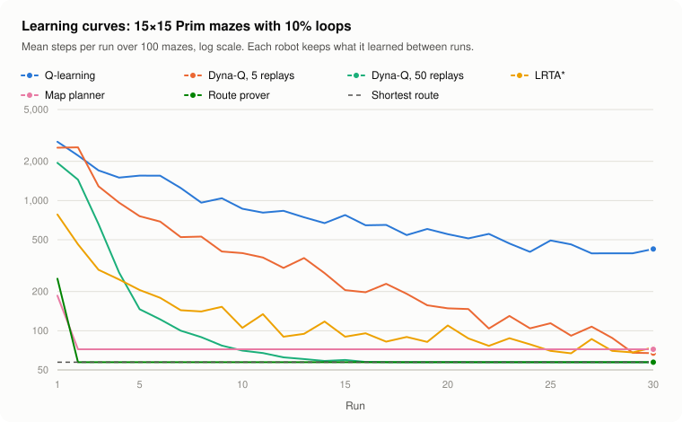

# Maze Robot Learning

[](https://github.com/AlexandruPascu/maze-robot-learning/actions/workflows/build.yml)

A robot explores a maze it has never seen, then runs it again using what it learned. This
repository runs my 2022 university coursework robot alongside two planning robots, robots that learn
from run to run or from maze to maze, and an A\* oracle on thousands of seeded mazes. It measures
what each one gains. One planner proves which route is shortest before it finishes its first run,
so every later run takes it, and a trained explorer finds the target faster on Prim mazes it never saw.
The simulator is self-contained Java 21 and deterministic on every platform.


*One Prim maze of 15×15 cells, with 10% of the walls left after carving knocked through, seed 1. Regenerate it with
`./gradlew run --args="render"`.*

## Results

Mean steps over 300 seeded mazes of 15×15 cells for each layout. Run 1 explores the unseen maze; run
2 starts again from the same place with whatever the robot remembered. "Shortest" is the A\* route.

| Maze, 15×15 cells | Shortest | Coursework run 1 | Coursework run 2 | Map planner run 1 | Map planner run 2 | Route prover run 1 | Route prover run 2 |
| --- | ---: | ---: | ---: | ---: | ---: | ---: | ---: |
| Prim, no loops | 59.4 | 437.9 | 59.4 | 303.1 | 59.4 | 295.4 | 59.4 |
| Backtracker, no loops | 183.7 | 411.6 | 183.7 | 183.7 | 183.7 | 183.7 | 183.7 |
| Prim, 10% loops | 57.2 | 640.8 | 130.4 | 187.5 | 74.0 | 256.1 | 57.2 |
| Backtracker, 10% loops | 80.7 | 667.0 | 265.0 | 127.1 | 101.9 | 309.9 | 80.7 |
| Prim, 25% loops | 56.4 | 830.0 | 261.8 | 118.5 | 72.9 | 218.0 | 56.4 |
| Backtracker, 25% loops | 61.2 | 886.6 | 395.0 | 86.3 | 75.5 | 223.0 | 61.2 |

The [full results](reports/summary.md) also cover 7×7 and 30×30 mazes. They show:

- **Perfect mazes have one route, and all three robots replay it.** Run 2 was a shortest route in
  every maze, for every robot.
- **The 2022 claim of "an average of 4x steps decrease on the 2nd run" depends on the maze.** On
  perfect mazes the median gain is 3.7× at 7×7 Prim and 14.7× at 30×30. It is only 1.4–2.4× on
  perfect backtracker mazes, whose single route already threads through much of the maze.
- **Loops break replay.** The coursework robot repeats its exploration trail, detours included. Its
  run 2 averages 1.7–13.1× the shortest route on mazes with loops. The map planner plans a fresh
  route on its map and stays within 1.1–1.5×.
- **The route prover's second run was a shortest route in all 5,400 benchmark mazes.**
  - **Perfect mazes:** its first run is 2–6% shorter than the map planner's on Prim mazes and the
    same on backtracker mazes.
  - **Mazes with loops:** the proof costs extra exploration on run 1, for example 256.1 steps instead
    of 187.5 on 15×15 Prim mazes with 10% loops. The prover has walked fewer steps in total by the
    5th to 17th run of the same maze.
- **On perfect backtracker mazes the first run of both planners is already a shortest route.** This
  held in all 900 such benchmark mazes, and tests check it with random targets. It follows from how depth-first
  carving works: every wall separates a cell from one of its ancestors in the carving tree. Each side
  branch is therefore sealed by walls the robot saw on its way in, and an optimistic planner never
  enters one. Prim mazes have no such guarantee.
- **A\* finds routes as short as Dijkstra's algorithm while expanding 8–77% fewer tiles.** The
  heuristic helps least on backtracker mazes without loops, whose winding corridors point away from
  the target.
- **D\* Lite made exactly the same moves as searching again from scratch in every benchmark maze,
  with 4.0–77.4× less work.** It repairs only what each newly seen wall changes, so its advantage
  grows with the maze.

## Learning across runs



Each robot ran every maze 30 times and kept what it learned between runs. The mazes are the
benchmark's first 100 15×15-cell mazes of each of the six types. A maze counts as settled when the
robot's last 10 runs there all took a shortest route; one shortest run is not enough, because a
learner can find a shortest route by chance and leave it again. "Shortest from run" is where that
final streak began, averaged over the settled mazes. The [learning report](reports/learning.md)
breaks it down by maze type.

| Robot | What it learns | Shortest from run | Mazes settled |
| --- | --- | ---: | ---: |
| Q-learning | A value for each move, from step costs alone; it is not told where the target is | never | 0% |
| Dyna-Q, 5 replays | The same, plus where each move leads, replaying 5 remembered moves per step | 17.0–20.0 | 0–65% |
| Dyna-Q, 50 replays | The same, replaying 50 remembered moves per step | 10.3–14.9 | 97–100% |
| LRTA\* | Distance estimates, starting from the Manhattan distance to the target, ignoring walls | 9.8–19.4 | 0–72% |
| Map planner | A map, planned on with D\* Lite | 1.0–2.0 | 5–100% |
| Route prover | A map, explored until its route is proven shortest | 1.0–2.0 | 100% |

The ranges run across the six maze types. They show:

- **Learning from step costs alone is slow.** Q-learning still averaged 347–625 steps on run 30,
  against shortest routes of 56–189. It never settled on a shortest route in any of the 600 mazes.
- **A model of the maze is what speeds learning up.** Replaying remembered moves spreads each
  lesson through the model. With 50 replays per step, Dyna-Q settled on the shortest route in
  97–100% of mazes, from run 10–15 on average. Over 30 runs it walked 18–28% of Q-learning's steps.
  With 5 replays it settled in at most 65% of mazes of a type, and in none with 25% loops.
- **On mazes with loops, knowing where the target is helps most early on.** There LRTA\*'s first
  run took 194–781 steps, against 1,469–1,947 for Dyna-Q with 50 replays. On perfect mazes it was
  the other way round: 1,819–2,280 steps against 1,725–1,739. LRTA\*'s estimates are local, so it
  often finds a shortest route and then leaves it again; it settled in 4–38% of mazes with loops.
- **Here, planning beats learning.** The route prover walked the fewest steps over 30 runs on every
  maze type, tied with the map planner on backtracker mazes without loops. A planner is what
  model-based learning becomes when the model is the map itself and the target is known. Learning
  has to earn its place by carrying experience from one maze to the next, as in the next section.

## Learning across mazes

The learned explorer carries experience from maze to maze: its weights are trained once on one set
of mazes, then fixed. It repeatedly walks to the frontier cell
with the lowest score, where a frontier cell is a reachable cell with walls it has not seen yet. The
score weights six features of each frontier, and the cross-entropy method trains the weights:

- **Training:** 25 generations of 40 sampled weight sets, refitted to the best 8 each time, on 300
  mazes of 15×15 cells: 50 of each type, from a seed the benchmark never uses.
- **Objective:** the mean, over the training mazes, of first-run steps divided by the steps of the
  same explorer using the map planner's freespace rule on that maze. Every maze counts equally
  ([training report](reports/training.md)).
- **Test:** the benchmark's 5,400 mazes, including 7×7 and 30×30 mazes, sizes it never trained on.

The table compares mean steps, and also each maze's own ratio averaged over the mazes, which is
what training minimised.

| First run on 15×15 mazes | Freespace rule, mean steps | Learned, mean steps | Change | Mean per-maze change | Mazes better / worse |
| --- | ---: | ---: | ---: | ---: | ---: |
| Prim, no loops | 302.7 | 266.5 | −12.0% | −9.7% | 239 / 54 |
| Backtracker, no loops | 183.7 | 183.7 | 0.0% | 0.0% | 0 / 0 |
| Prim, 10% loops | 187.6 | 167.2 | −10.9% | −9.4% | 219 / 54 |
| Backtracker, 10% loops | 126.5 | 125.6 | −0.7% | +2.1% | 107 / 111 |
| Prim, 25% loops | 118.7 | 108.4 | −8.7% | −8.1% | 213 / 47 |
| Backtracker, 25% loops | 86.5 | 84.1 | −2.7% | −0.9% | 125 / 87 |

Across all sizes ([full results](reports/summary.md#learning-across-mazes)):

- **On Prim mazes the learned weights cut mean first-run steps by 3.0–13.7% at every size.** Maze
  by maze the gain is 7.9–12.2% at 15×15 and 30×30, so what they learned carries over to larger
  mazes. At 7×7 it is small: from 2.6% better to 0.7% worse, though more mazes got shorter than
  longer in every 7×7 Prim type.
- **Perfect backtracker mazes are unchanged.** Both rules already take a shortest route there.
- **On backtracker mazes with loops the gains are small or absent.** Mean steps change by −2.7% to
  +1.0%, and the mean per-maze change is −1.4% to +2.2%. At 15×15 with 10% loops the learned rule
  is about even: 107 mazes shorter, 111 longer.
- **What it learned:**
  - **Detours:** the weights on the optimistic distance to the target (2.03) and the Manhattan
    distance (−0.72) together penalise frontiers whose best possible route already bends around
    known walls.
  - **Preferences:** it also prefers openings that face the target and frontiers found recently.
- **Training is reproducible:** `./gradlew run --args="train"` rebuilds `models/explorer.weights`
  byte for byte. CI retrains on Linux, macOS and Windows and fails if the weights change.

## Quick start

You need JDK 21 or newer. The Gradle wrapper downloads Gradle itself. On Windows, use `gradlew.bat`.

```sh
./gradlew build                                                      # compile and run the tests
./gradlew run --args="show --agent route-prover --loops 0.25 --seed 4" # one maze in the terminal
./gradlew run --args="train"                                         # about 20 s; retrains the explorer
./gradlew run --args="benchmark"                                     # about 30 s; rewrites reports/
./gradlew run --args="learn"                                         # about 15 s; learning curves and chart
./gradlew run --args="render"                                        # rewrites docs/maze.svg
./gradlew run --args="help"                                          # every option
```

`show` draws the maze two characters per tile, so it looks square, under a legend. It compares the
last run's route (run 2 unless `--runs` says otherwise) with the shortest route that overlaps it
most:

| Mark | Meaning |
| --- | --- |
| `##` | Wall |
| `..` | Visited on run 1 only |
| `**` | Last run on a shortest route |
| `~~` | Last-run detour |
| `++` | Shortest route that the last run missed |
| `S`, `T` | Start and target |

Options select:

- the robot: `coursework`, `map-planner`, `route-prover`, `a-star`, `q-learning`, `dyna-q` (50
  replays), `lrta-star`, `frontier-explorer` or `learned-explorer`;
- how many runs to make, for example `--runs 20` to see what a learner does on its 20th run;
- the layout: `prim` or `backtracker`;
- the size in cells, the share of loops, a corner or random target, and the seed.

The drawing is in colour when the output reaches a terminal. Through `./gradlew run`, which hides
the terminal from the program, it assumes one whenever `TERM` names a terminal type, so add
`--color never` when redirecting that command's output to a file. Colour only restyles the same
characters. `NO_COLOR=1` turns it off and `FORCE_COLOR=1` turns it on; `--color always` or
`--color never` beats both.

## The robots

**Coursework explorer (2022).** My original coursework solution, run unchanged apart from an injectable
random source. On run 1 it explores at random, depth first. It prefers exits it has not visited,
backtracks from dead ends, and keeps a stack of the cells on its current route with the heading it
arrived in. On run 2 it replays that stack.

**Map planner.** Records every wall and passage it senses in a map that it keeps between runs.

- **Run 1:** it heads along a shortest route to the target as if every unknown tile were open, which
  robot navigation calls planning under the freespace assumption. It plans with D\* Lite (Koenig and
  Likhachev, 2002). D\* Lite searches backwards from the target and, when the robot sees a new wall,
  repairs only the distances that wall changes.
- **Run 2:** it plans only through tiles it has seen to be open, so it never gambles on an unexplored
  shortcut, and sometimes misses one.

**Route prover.** Explores until it can prove which route is shortest, in the spirit of Micromouse
robots that search a maze before racing it. It knows the maze is a grid of cells with fixed pillars
between them, so it reasons about the walls between cells.

- **Two bounds:** treating unknown walls as open gives a lower bound on the shortest route from the
  start. Using only passages it has seen gives an upper bound. When the two meet, the known route is
  provably shortest.
- **What to inspect:** until then it inspects the nearest unknown wall that lies on a route as short
  as the lower bound, preferring walls nearer the target.
- **The target:** it does not step onto the target until the proof is complete, so run 2 and every
  run after it take a shortest route.

**Q-learning and Dyna-Q.** Learn a value for every move on every tile from the cost of their own
steps, where each step is worth −1. Neither is told where the target is; they recognise it only by
arriving there.

- **Exploration:** untried moves start at the best possible value, so the robot keeps trying new
  moves until none look better. Ties are broken at random.
- **Updates:** the maze is deterministic, so each update is exact.
- **Replay:** Dyna-Q (Sutton, 1990) also remembers where each move led and replays remembered moves
  after every real step.

**LRTA\*.** Learning Real-Time A\* (Korf, 1990) keeps an estimate of every tile's distance to the
target, starting from the Manhattan distance, which ignores walls. Each step it moves to the neighbour with
the lowest one step plus estimate, and raises its own tile's estimate to match. The estimates never
overshoot the true distance, and over repeated runs they converge on a shortest route.

Like every other robot, the learners see the walls next to them, and in the learning report they
never walked into one.

**Frontier explorer and learned explorer.** Both know the maze is a grid of cells, like the route
prover. On run 1 they walk through known passages to the frontier cell with the lowest score,
inspect its walls, and choose again; later runs take the shortest known route.

- **Frontier explorer:** scores each frontier by travel plus optimistic distance to the target,
  which is the map planner's freespace rule.
- **Learned explorer:** uses the six trained weights shipped in `models/explorer.weights`.

**A\* oracle.** Is handed the full map and follows an A\* route using the Manhattan distance, which
never overestimates on this grid. It sets the lower bound for the other robots. The benchmark also
runs Dijkstra's algorithm, which is A\* without the heuristic, to measure how much work the
heuristic saves.

## The simulator

- **Mazes:** a maze is a grid of wall and floor tiles with cells on odd coordinates. A perfect maze
  is carved by randomised Prim's algorithm or a recursive backtracker, starting from the top-left
  cell. Loops come from knocking through a share of the remaining walls between cells. The target is
  the bottom-right cell or a random one.
- **Sensing and moving:** sensing matches the coursework framework. Before each step a robot sees its
  four neighbouring tiles as wall, passage or been-before, plus its position, heading, the target's
  position and the run number. It then turns and moves one tile; walking into a wall still costs a
  step.
- **The `Robot` interface:** robots implement `beginMaze`, `beginRun`, `act` and `afterStep`.
  `afterStep` reports every move's outcome, which Q-learning and Dyna-Q learn from.
- **Determinism:** all randomness is seeded through `java.util.Random`, whose algorithm is specified
  exactly. The same seed therefore reproduces a maze and a robot's choices on any JVM and operating
  system. CI builds and tests on Linux, macOS and Windows with Java 21, and on Linux with Java 25.
  It also retrains the explorer, regenerates the reports, learning curves and both images, and
  fails if a single byte changes.

## Code and tests

| Path | Contents |
| --- | --- |
| `src/main/java/io/github/alexandrupascu/maze/` | Grid model: `Maze`, `Position`, `Heading`, `Direction`, `Sight` |
| `…/generate/` | `MazeSpec`: Prim and backtracker carving, loops, target placement |
| `…/sim/` | `MazeEnvironment`, `Robot`, `Runner`, `SearchWork` and the observation types |
| `…/coursework/` | The ported 2022 controller, its adapter and the `IRobot` re-declaration |
| `…/agents/` | `MapPlanner`, `RouteProver`, `AStarOracle` and the agent registry |
| `…/learning/` | `QLearner` (Q-learning and Dyna-Q), `LrtaStar`, `FrontierExplorer`, `ExplorationPolicy`, `CrossEntropyMethod` |
| `…/search/` | A\*, Dijkstra's algorithm and D\* Lite |
| `…/bench/` | The two-run benchmark, the learning curves, the training report |
| `…/render/`, `…/cli/` | SVG and text drawings, the learning chart, command line |
| `coursework/` | The 2022 files, byte for byte ([notes](coursework/README.md)) |
| `models/` | The trained exploration weights, shipped with the program |
| `reports/` | Benchmark results, learning curves and training history as CSV and Markdown |

`./gradlew build` compiles with all warnings as errors and runs 91 JUnit tests. They cover:

- **Mazes:** generator properties (spanning trees, loop counts, recorded seeds).
- **Simulation:** the simulator's movement and sensing rules.
- **Robots:**
  - that the port matches the original code;
  - every robot's guarantees on perfect and looped mazes, including that the route prover only
    enters the target once its route is proven;
  - the depth-first property above;
  - that both map planners make identical moves.
- **Learning:**
  - that the learners never walk into a wall they have seen;
  - that Dyna-Q and Q-learning learn a shortest route, and that replay saves steps;
  - that LRTA\*'s estimates never exceed the true distances and settle on a shortest route;
  - that the learning curves are deterministic and the chart is well-formed;
  - that both exploration rules finish safely and then retrace a known shortest route;
  - that training is deterministic and never uses benchmark mazes, and that the shipped weights
    differ from the freespace rule (CI checks that they match a fresh training run byte for byte).
- **Search:**
  - that A\* and Dijkstra agree with breadth-first search;
  - that D\* Lite agrees with a fresh breadth-first search after every wall it learns and wherever
    the robot moves;
  - that the route used for drawings is the shortest route overlapping a run the most, checked
    against every shortest route on small mazes.
- **Drawings:** the terminal marks, that colour changes nothing but styling, and when colour is used
  (terminals, `./gradlew run`, `NO_COLOR`, `FORCE_COLOR`, Windows consoles).
- **Reports and CLI:** report determinism, including under a non-English locale, and the command
  line.

## Background and credit

This project began as university robot-maze coursework, uploaded in 2022. The originals are in
[coursework/](coursework/), unchanged, with notes on what each file is. They were written against
the course's maze framework, which belongs to the university and is not included. The simulator here is an independent implementation of what the robot needs: four-way
sensing, been-before marks and repeated runs.

The 2022 description presented the robot as a mix of Dijkstra's, Trémaux's and A\* algorithms
forming an "Iterative Machine Learning maze solver robot". The code is a randomised depth-first explorer with
route replay, and the measurements above replace that description.

## Next

- **The proof:** the route prover's proof costs extra exploration on mazes with loops. Learning
  which walls to inspect first, the same way the explorer learned where to look, could make it
  cheaper.
- **Backtracker mazes:** on backtracker mazes with loops the learned explorer gains little, and
  maze by maze it is up to 2.2% worse. Features that tell the maze types apart, or a policy per
  type, are the obvious next try.

## Licence

[MIT](LICENSE)
